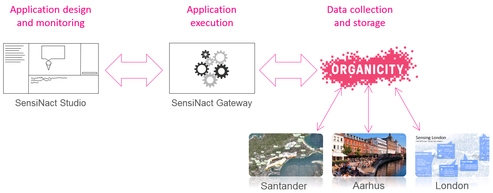

# SensiNact

SensiNact aims at helping coders working with data streams from deployed “IoT” devices without the need to complex API configuration.

Using SensiNact, experimenters can find Internet of Things devices which are deployed in the city, and understand the data streams that they provide. The SensiNact IDE allows the creation of applications using a scripting tool (with Code Assist functionality). These applications might set up alerts for when variables in the data streams reach certain levels, or can aggregate data from many devices, creating virtual devices which provide coarse data that might be more useful to an experiment.

##Architecture

The following schema summaries the way SensiNact integrates with the OrganiCity Experimentation as a Service facility.

  

The Organicity EaaS facility collects and stores data from the federated sites (Santander, Aarhus and London, on this schema). SensiNact Gateway is connected to this platform, and is notifed when IoT devices is added, removed, or when sensed data is updated. SensiNact studio provides a graphical UI to the gateway. It ease discovering devices, and provides an editor to write applications using IoT devices.

##Installation

To use sensiNact, you need a gateway, and the studio.

**SensiNact gateway** will be provided as a service, in the cloud. To get the url and your credentials, please contact [Etienne Gandrille](mailto:etienne.gandrille@cea.fr).

**SensiNact studio**is based on the well known Eclipse IDE. To recieve a download link, please contact [Etienne Gandrille](mailto:etienne.gandrille@cea.fr).

## Studio

The central part of the Studio is the database of available devices. The content of this database is kept synchronized with the gateway using two mechanisms.

Actively, the database can query the gateway through the HTTP client to obtain up to date information. This facility is used when the studio starts, to get an up to date devices database. Then, the Studio registers to gateway. When the state or the availability of a device changes, the gateway sends a notification to the studio. This notification is received by the HTTP server, processed by the model manager which updates the database accordingly.

Two views allow the user to interact with devices: the Devices List View and the Device Location Map.

The devices List View offers a tree view for browsing all the devices available on the gateway. This view also allows basic interaction with devices, such as getting the current value of variables (ie, the temperature of a thermometer) or acting on them (ie, turning on a light). When such an interaction is asked by the user, a request is sent to the gateway through the HTTP client.

Device Location Map puts a pinpoint on a worldwide map for the device for which the position is known. This is a very convenient way to understand the geographical distribution of devices. Clicking on the pinpoint, a pop up displays device related information, such as its current internal state. The pinpoints can also be dragged and dropped on the map from the device list to update the device location. This interaction is managed by the device Location Manger, which updates the devices database, which then sends a position update request to the gateway.

The other part of the studio is dedicated to application creation, management and monitoring. To interact with the studio, the user can edit “*.sna” files in a dedicated editor: the application editor. The content of the files is continually checked by a grammar checker, to ensure the content is written according to a domain specific language. When the file describing the application is well formed, it can be deployed to the gateway using the app manager.

## Application creation

SensiNact Studio provides...
